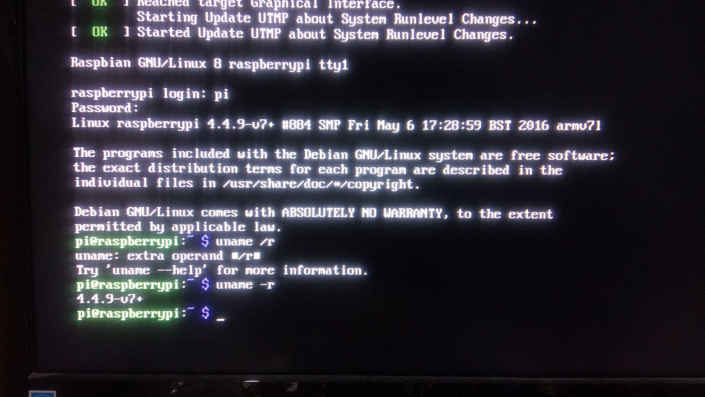
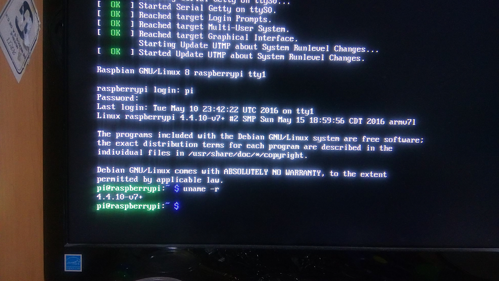

# Compilacion Cruzada

## Introduccion

La compilacion de codigo fuente realizado bajo una determinada arquitectura que genera codigo ejecutable para una arquitectura diferente se llama __compilacion cruzada__ .

En la compilacion cruzada hay dos tipos de sistemas

__*huesped*__
:Nos brinda la oportunidad de aprovechar los recursos que disponemos, por lo general son arquitecturas mas poderosas (multicore)

__*objetivo*__ :
donde se ejecuta el codigo.

para realizar este tipo de compilacion nos apoyamos de __toolchain__.

## toolchain

Es un conjunto de programas informáticos (herramientas) que se usan para crear un determinado producto (normalmente otro programa o sistema informático). Los distintos programas se suelen usar en una cadena, de modo que la salida de cada herramienta sea la entrada de la siguiente.

### Componentes de toolchain

+ __GNU make__ Para la automatizacion de la estructura y compilado.

+ __Compilador C:__ Es el segundo componente de un _toolchain_ , es el generador de codigo objeto (tanto de kernel como de aplicaciones)

+ __GNU Binary:__  Es un conjunto de programas necesarios para la compilación, enlazado, ensamblado y depuración de código. Entre otros, los binarios principales son: ld (GNU linker), as (GNU assembler).

+ __Biblioteca C:__ La biblioteca de C implementa la API POSIX tradicional que se puede utilizar para desarrollar aplicaciones de espacio de usuario . Se conecta con el núcleo a través de llamadas al sistema , y proporciona servicios de mayor nivel.

+ __Debugger:__ El depurador también suelen formar parte del _toolchain_ , ya que se necesita un depurador cruzado para depurar aplicaciones se ejecutan en el equipo de destino. El depurador GDB es típico

### toolchain Raspberry Pi

Raspberry tiene un _toolchain_, lanzada por *Linaro*. Esta optimizada para los CPUs ARM recientes (cortex A8,A9).

## Compilacion para la Raspberry Pi 2

### Sistema huesped

A continuacion se muestra una descripcion del CPU que sera utilizado como *huesped*

+ Arquitectura:          x86_64
+ CPU op-mode(s):        32-bit, 64-bit
+ Orden de bytes:        Little Endian
+ CPU(s):                4
+ On-line CPU(s) list:   0-3
+ Hilo(s) por núcleo:   2
+ Núcleo(s) por zócalo:2
+ Socket(s):             1
+ Nodo(s) NUMA:          1
+ ID del vendedor:       GenuineIntel
+ Familia de CPU:        6
+ Modelo:                42
+ Stepping:              7
+ CPU MHz:               806.167
+ BogoMIPS:              4585.29
+ Virtualización:       VT-x
+ caché L1d:            32K
+ caché L1i:            32K
+ caché L2:             256K
+ caché L3:             3072K
+ NUMA node0 CPU(s):     0-3

### Obtencion del toolchain

Obtenemos las herramienta de la siguiente forma:

	$ git clone https://github.com/raspberrypi/tools

posteriormente los agregamos al PATH

	PATH=/home/carlos/cross/tools/arm-bcm2708/gcc-linaro-arm-linux-gnueabihf-raspbian/bin:$PATH

### Obtener las fuentes

Para obtener la fuente de linux lo clonamos de la siguiente manera:

	$ git clone --depth=1 https://github.com/raspberrypi/linux

### Contruyendo para la compilacion cruzada

Nuestro sistema objetivo esta descrito a continuacion.

+ Architecture:          armv7l
+ Byte Order:            Little Endian
+ CPU(s):                4
+ On-line CPU(s) list:   0-3
+ Thread(s) per core:    1
+ Core(s) per socket:    4
+ Socket(s):             1

Para crear el archivo .config solo tenemos que seguir los siguientes pasos:

	cd linux
	KERNEL=kernel7
	make ARCH=arm CROSS_COMPILE=arm-linux-gnueabihf- bcm2709_defconfig

Ahora simplemente hay que ejecutar el siguiente comando:

	make ARCH=arm CROSS_COMPILE=arm-linux-gnueabihf- zImage modules dtbs

Esto tomara un tiempo largo dependiendo del equipo husped. En mi caso fueron aproximadamente 30 min.

### Instalando a la SD

Ahora que tenemos el kernel compilado el siguiente paso es copiarlo a la SD. Primero usamos:

	lsblk

De esta manera identificar la SD, en mi caso esta de la siguiente manera:

	sdb
		sdb1
		sdb2

montamos las particiones de la siguiente manera:

	mkdir mnt/fat32
	mkdir mnt/ext4
	sudo mount /dev/sdb1 mnt/fat32
	sudo mount /dev/sdb2 mnt/ext4

Despues instalamos los modulos

	sudo make ARCH=arm CROSS_COMPILE=arm-linux-gnueabihf- INSTALL_MOD_PATH=mnt/ext4 modules_install

como ultimo paso copiamos el kernel y device tree

	sudo cp mnt/fat32/$KERNEL.img mnt/fat32/$KERNEL-backup.img
	sudo scripts/mkknlimg arch/arm/boot/zImage mnt/fat32/$KERNEL.img
	sudo cp arch/arm/boot/dts/*.dtb mnt/fat32/
	sudo cp arch/arm/boot/dts/overlays/*.dtb* mnt/fat32/overlays/
	sudo cp arch/arm/boot/dts/overlays/README mnt/fat32/overlays/
	sudo umount mnt/fat32
	sudo umount mnt/ext4

### Arranque del sistema

Ahora con la SD lista ya podemos arrancar nuestro sistema embebido

Como comparacion tenemos el arranque de la version anterior del kernel

en donde se ve la version del kernel 4.4.9-v7

Para la version nueva tenemos la siguiente imagen

en donde se ve la version del kernel 4.4.10-v7

## ¡Ahora ya podemos probar nuestro sistema embebido!
