# Compilacion Cruzada

## Introduccion

La compilacion de codigo fuente realizado bajo una determinada arquitectura que genera codigo ejecutable para una arquitectura diferente se llama __compilacion cruzada__ .

En la compilacion cruzada hay dos tipos de sistemas

__*huesped*__
:donde nos brinda la oportunidad de aprovechar los recursos que disponemos  

__*objetivo*__ :
donde se ejecuta el codigo.

para realizar este tipo de compilacion nos apoyamos de __Builroot__.

## Builroot

Esta es una herramienta que simplifica y automatiza el proceso de construccion de un sistema embebido linux completo, usando compilacion cruzada.

### Requerimientos de sistemas

Builroot esta diseñado para correr en sistema linux.

Esta es una lista general de los paquetes obligatorios para ejecutar *builroot*:

+ which
+ sed
+ make (version 3.81 or any later)
+ binutils
+ build-essential (only for Debian based systems)
+ gcc (version 2.95 or any later)
+ g++ (version 2.95 or any later)
+ bash
+ patch
+ gzip
+ bzip2
+ perl (version 5.8.7 or any later)
+ tar
+ cpio
+ python (version 2.6 or any later)
+ unzip
+ rsync
+ wget
+git

## Compilacion para la Raspberry Pi 2

### Sistema huesped

A continuacion se muestra una descripcion del CPU que sera utilizado como *huesped*

+ Architecture:          x86_64
+ CPU op-mode(s):        32-bit, 64-bit
+ Byte Order:            Little Endian
+ CPU(s):                12
+ On-line CPU(s) list:   0-11
+ Thread(s) per core:    2
+ Core(s) per socket:    6
+ Socket(s):             1
+ NUMA node(s):          1
+ Vendor ID:             GenuineIntel
+ CPU family:            6
+ Model:                 45
+ Model name:            Intel(R) Xeon(R) CPU E5-2620 0 @ + 2.00GHz
+ Stepping:              7
+ CPU MHz:               1814.062
+ BogoMIPS:              4000.22
+ Virtualization:        VT-x
+ L1d cache:             32K
+ L1i cache:             32K
+ L2 cache:              256K
+ L3 cache:              15360K
+ NUMA node0 CPU(s):     0-11

### Obtencion de buildroot

Primero tenemos que obtener directamente de la pagina de buildroot

	$ wget https://buildroot.org/downloads/buildroot-2016.02.tar.gz

### Descomprimir el archivo

Una vez que tenemos el archivo bastara con descomprimirlo

	 $ tar xvzf buildroot-2016.02.tar.gz

### Configuracion para Raspberry Pi 2

Nuestro sistema objetivo esta descrito a continuacion.

+ Architecture:          armv7l
+ Byte Order:            Little Endian
+ CPU(s):                4
+ On-line CPU(s) list:   0-3
+ Thread(s) per core:    1
+ Core(s) per socket:    4
+ Socket(s):             1

Accedemos al directorio descomprimido y como la Raspberry Pi 2 es una tarjeta popular ya existe un archivo de configuracion paa esta tarjeta ( como tambien lo existe para la version 1 y recientemente para la version 3)

Ahora simplemente hay que ejecutar el siguiente comando:

	$ make raspberrypi2_defconfig

Ahora para agregar paquetes a nuestra compilacion simplemnte ejecutamos:

	$ make menuconfig

Nos muesta ventanas donde podemos elegir paquetes o opciones de compilacion que previamente no incluia el archivo *"raspberrypi2_defconfig"* y podemos ver de manera grafica las opciones cargadas en el archivo __config__.

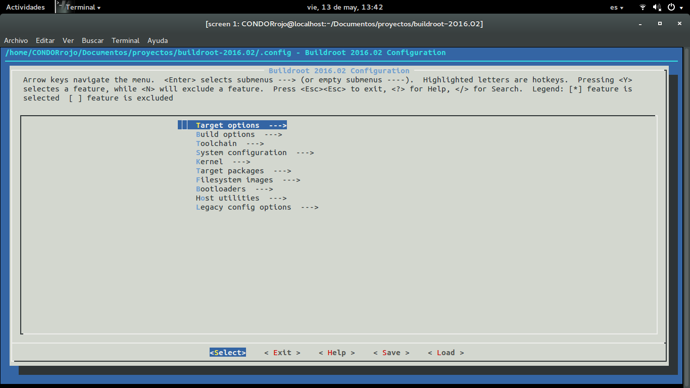

Entrando a la opcion de "Target Architecture" podemos notar que la arquitectura "ARM (little endian)" ya esta seleccionada debido al *"raspberrypi2_defconfig"*

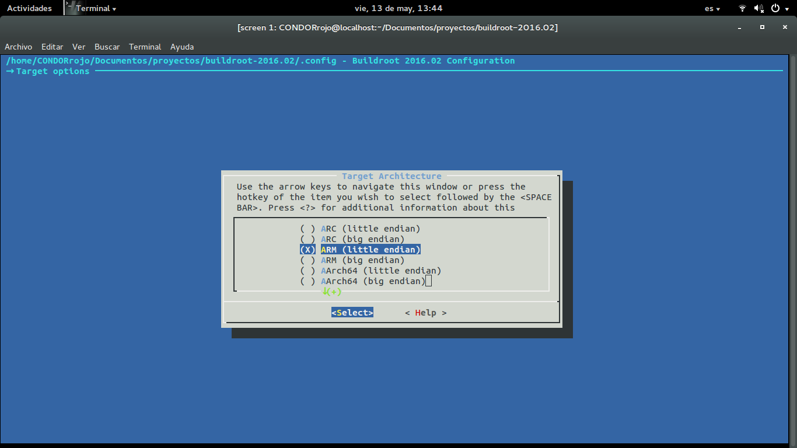

Lo mismo sucede para la "Variante"

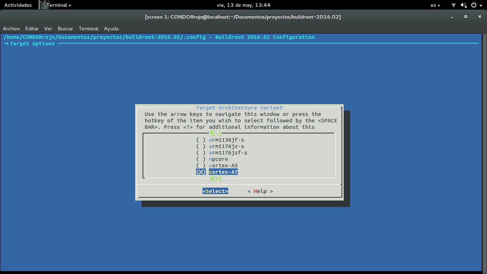

Tambien tenemos las opciones de construir, donde se indica los directorios de descarga y host. Tambien el numero de trabajos que corren simultanemante y varias opciones que se pueden manipular para optimizar la construccion.

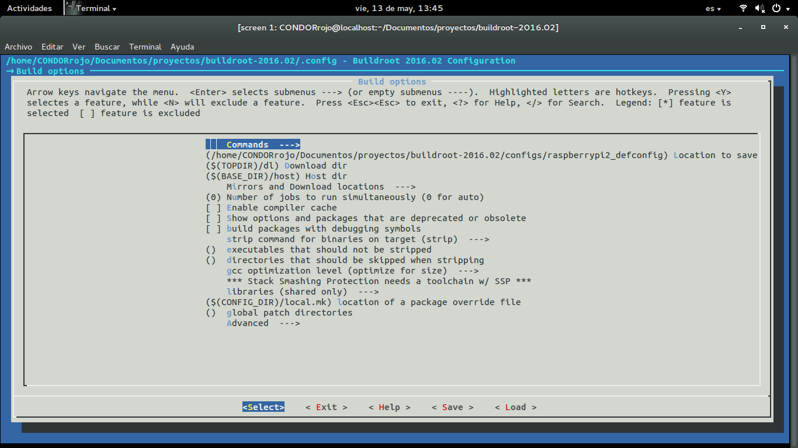

Lo mismo ocurre para el "Toolchain", donde podemos indicar opciones para cabeceras del kernel (versiones), opciones de GCC como seria la version que queremos instalar en nuestro sistema.

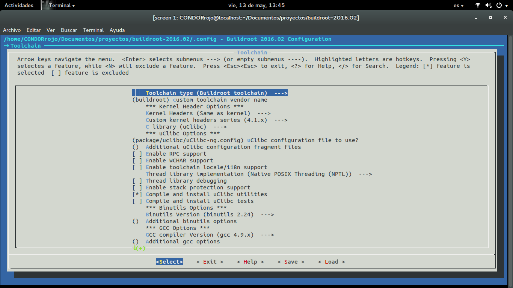

Asi como Suporte para otro lenguajes como C++ o compilar OpenMP (Que en mi caso activo ya que quiero trabajar con procesamiento paralelo)

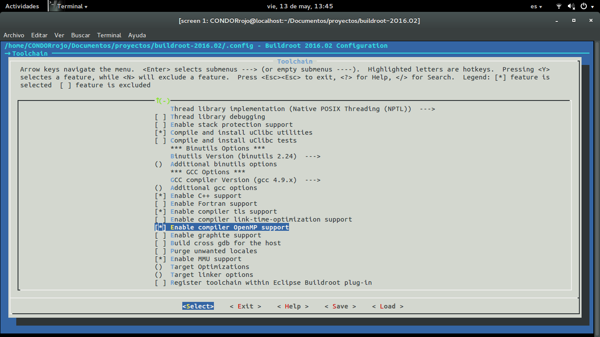

Otra opcion es "System Configuration", donde entre algunas de las opciones que se especifican son el "System banner", El tipo de codificacion de contraseñas, especificar si el login del root es con contraseña e indicar la misma.

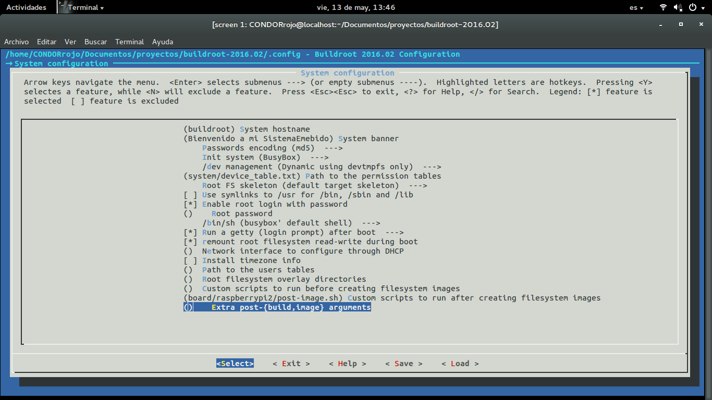

Para el "Kernel", podemos indicar de donde descargar el repositorio.

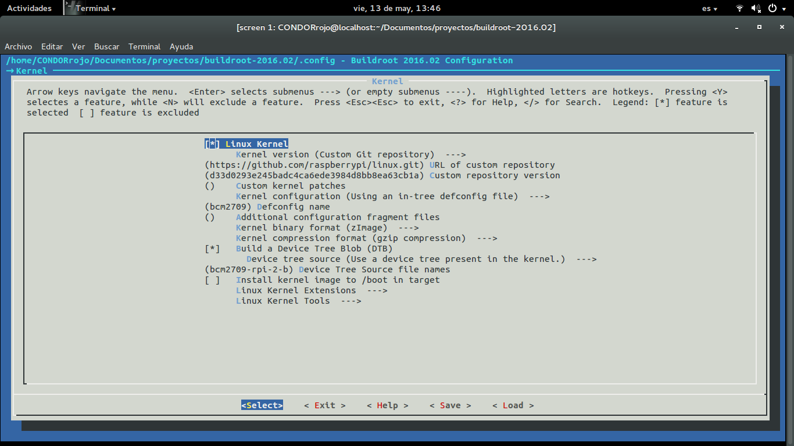

Otra opcion interesante es el "Target packages" donde podemos elegir paquetes que nos puedan ayudar en e objetivo de nuestro sistema embebido. Como estoy habituado a usar emacs decido instalar uemacs.

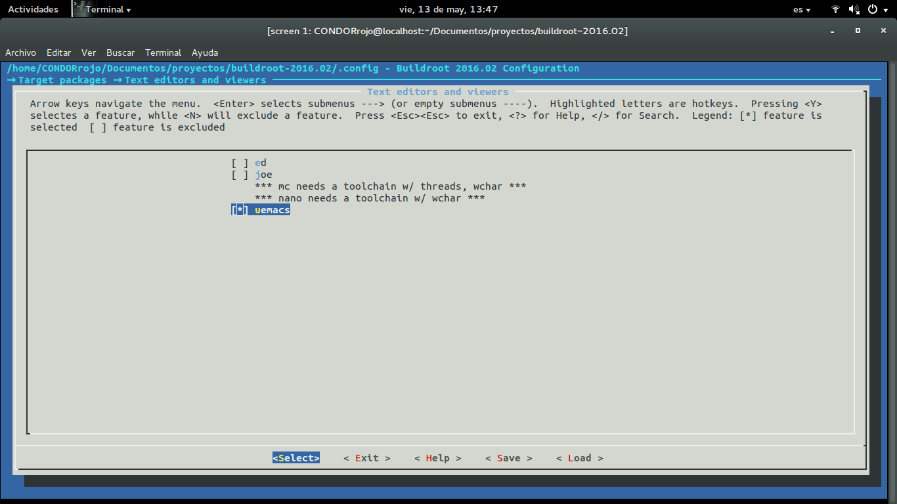

Tambien podemos agregar leguajes interpretador o scripting, en mi caso decidi instalar "micropython"

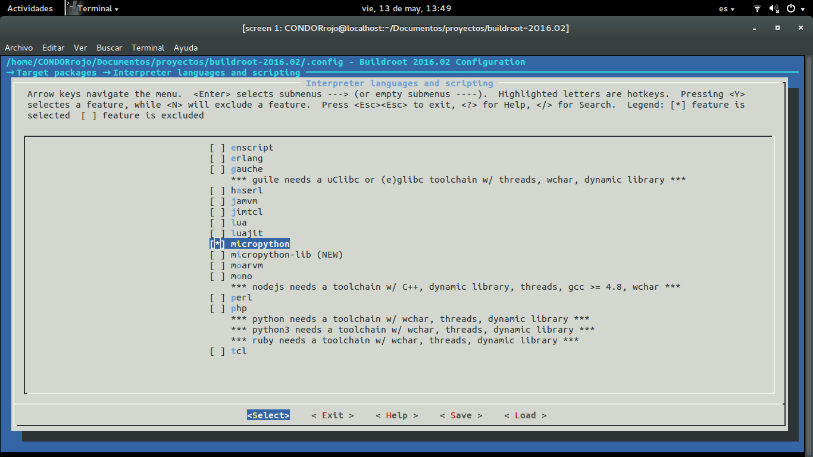

Finalmente ejecutamos el comando make y esperamos un tiempo (en mi caso 40 min)

	$ make

Pasado este tiempo obtenemos en la carpeta "output" tenemos los archivos que nos serviran para nuestro sistema embebido.

Basta con copiar el archivo "sdcard.img" a una memoria SD sin forrmato. Esto lo podemos hacerlo mediante el comando "dd" ejecutandolo desde el directorio que contiene la imagen de la siguiente manera:

	sudo dd if=sdcard.img of=/dev/sdb

### Arranque del sistema

Ahora con la SD lista ya podemos arrancar nuestro sistema embebido

en la pantalla tenemos esto:

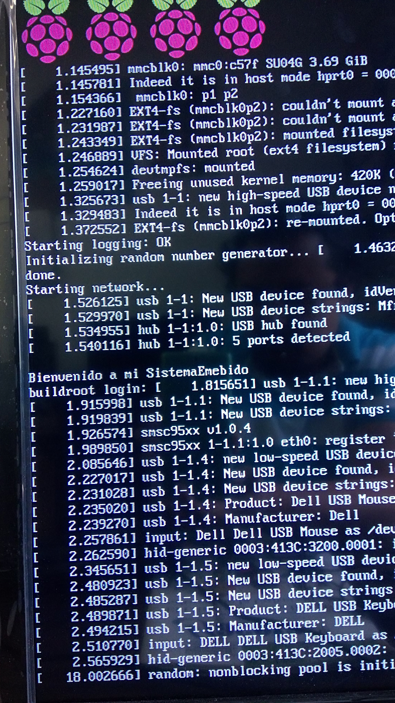

Se puede apreciar el banner personalizado:

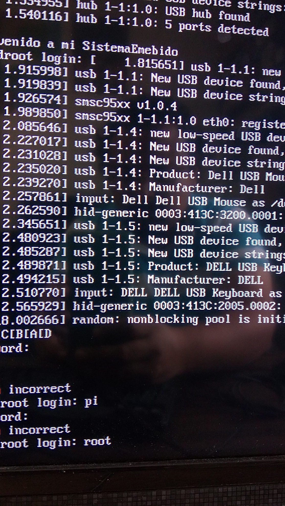

En el siguiente archivo se presenta el arbol de directorios

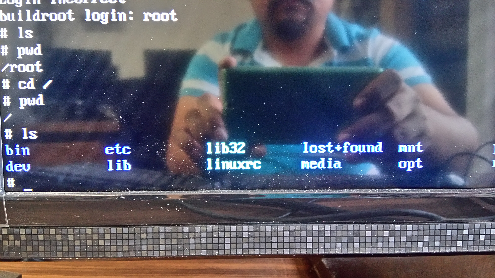

Tambien podemos ver informacion del espacio usado

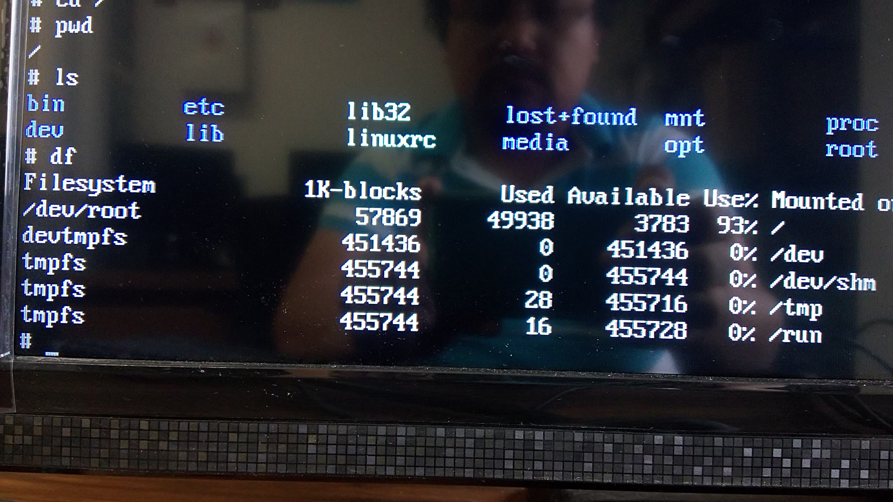

Y tambien informacion del sistema

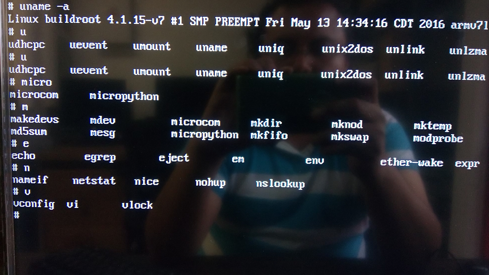

Ahora ya podemos probar nuestro sistema embebido 
